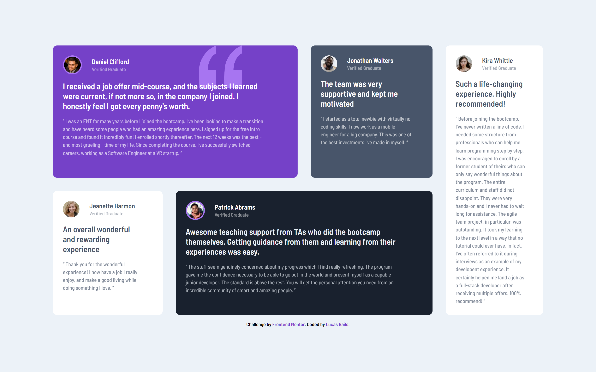

## Welcome! 👋

# Frontend Mentor - Testimonials grid section

This is a solution to the [Testimonials grid section challenge on Frontend Mentor](https://www.frontendmentor.io/challenges/testimonials-grid-section-Nnw6J7Un7). Frontend Mentor challenges help you improve your coding skills by building realistic projects.  

### Screen Shot
- Desktop


- Mobile

    

## Some code that I'm proud of
```css
.grid__container {
        grid-template-columns: 0.9fr 1fr 1fr 0.8fr;
        grid-template-areas: 
        "Daniel Daniel Jonathan Kira"
        "Jeanette Patrick Patrick Kira";
}
```

## Built with

- Semantic HTML5;
- CSS custom properties;
- Flexbox;
- Grid;
- Responsive Desgin;

## Test the project on your device: [Teste the project here!!!](#)

- Min-widths: 1040px - 375px
- My Solution URL: [Challenge Solution](#)

## Author

- Website - [My GitHub](https://github.com/lucasbailo)
- Frontend Mentor - [@lucasbailo](https://www.frontendmentor.io/profile/lucasbailo)
- Instagram - [@lucassbailo](https://www.instagram.com/lucassbailo/)
- LinkedIn - [Lucas Bailo](https://www.linkedin.com/in/lcsbailo)